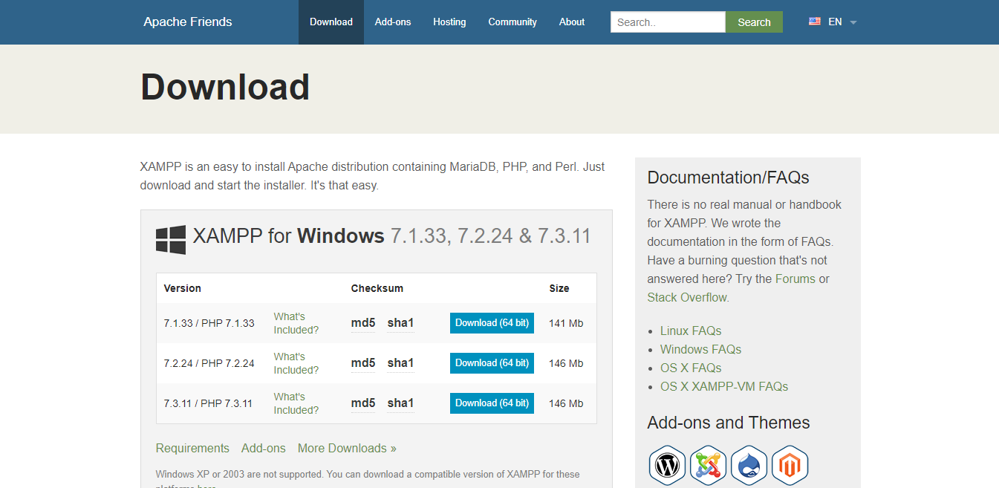
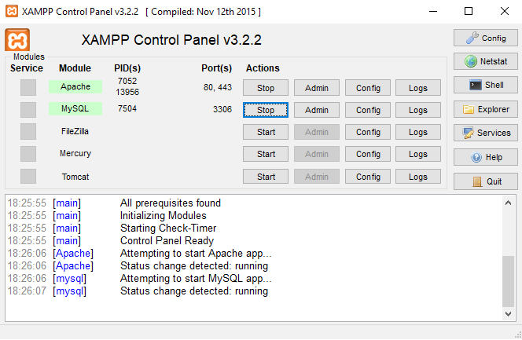
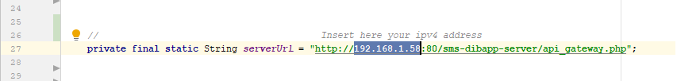

# REQUIREMENTS:

#

- --Android Studio
- --Xampp (you can dowload it [here](https://www.apachefriends.org/it/download.html))
- --DibApp source code

# HOW TO GET STARTED:

- --Copy the directory called &quot;sms-dibapp-server&quot; from DibApp project in &quot;...\xampp\new\htdocs&quot;
- --Run XAMPP Control panel and click on Start button for Apache and MySQL

- --Click Admin button in MySQL line and create a new DB called dibapp
- --Import in the newly created DB &quot;dibapp.sql&quot; from  &quot;sms-dibapp-server&quot; directory
- --Get your internal ipv4 address (please use [this guide](https://lifehacker.com/how-to-find-your-local-and-external-ip-address-5833108) )
- --Set your internal ipv4 in AsyncTaskConnection on line 27 as shown in figure

- --Build and run DibApp using your Android emulator

# Please use the following accounts for testing purposes:

#

Student:

- --email:  [bellinelli@gmail.com](mailto:bellinelli@gmail.com)
- --password: 123

Professor:

- --email: [buono@uniba.it](mailto:buono@uniba.it)
- --password: Buono123
